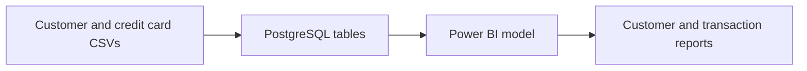

# Credit Card Financial Analytics
### Power BI · PostgreSQL · Customer & Transaction Reporting

A financial analytics portfolio project bringing customer attributes and credit card activity into one reporting workflow. The business focus is understanding revenue composition, transaction behaviour, and customer segments.

## Explore the project

- [Customer dashboard PDF](Credit%20Card%20Customer%20Dashboard.pdf)
- [Transaction dashboard PDF](Credit%20Card%20Transaction%20Dashbord.pdf)
- [Power BI report](credit%20card%20project.pbix)
- [Database setup and import script](SQL%20Query%20-%20Financial%20Dashboard%20Data.sql)

## Data flow

This describes the repository's intended workflow. Refresh mode, relationships, and measures should be inspected in the PBIX; no live service deployment is included.

## Source assets

| Asset | Purpose |
| --- | --- |
| `credit_card.csv` | Base credit card activity |
| `customer.csv` | Customer attributes |
| `cc_add.csv`, `cust_add.csv` | Additional load files |
| SQL script | Creates `cc_detail` and `cust_detail` and imports CSVs |

The shared field is `Client_Num`. Check customer-key uniqueness and the activity grain before choosing relationship cardinality. A customer can have multiple activity records; joining to duplicated customer rows would inflate totals.

## Reproduce locally

1. Download the repository and open the PDF previews.
2. Use a dedicated PostgreSQL development database. Create `ccdb`, then connect to it before creating tables.
3. Review the SQL script and replace its example file paths. PostgreSQL `COPY` reads files visible to the database server.
4. Inspect date formats before importing. Set the appropriate date style before the load.
5. Import the base files once. The additional files are append examples; the script does not prevent duplicate reloads.
6. Open the PBIX in Power BI Desktop, update source connection details, review relationships, and refresh.
7. Compare totals and row counts with PostgreSQL before trusting the visuals.

## Metric review

Validate revenue components against the actual DAX definition; transaction amount and revenue are different concepts. For activation and delinquency, document whether the denominator is customers, accounts, or activity rows. Compare weekly totals using a consistent calendar and complete periods.

The previous project summary reported 57M revenue, 8M interest, and 46M transaction amount. These are historical portfolio observations, not independently revalidated results or employer outcomes. Currency, measure definitions, and filters must accompany any reuse of those numbers.

## Next engineering improvements

- Add a tested staging-to-target load with a documented business key.
- Export measure definitions and model documentation for code review.
- Add reconciliation checks, refresh monitoring, and measured performance results.
- Document and test access roles before sharing customer-level data.

**Current evidence:** report files, PDFs, CSVs, and SQL ingestion code. Automated refresh, access-role tests, and production deployment are not demonstrated here.

---
[Explore the full Power BI, Fabric & Data Engineering portfolio](https://github.com/Osama-data/Power-Bi-Projects)
